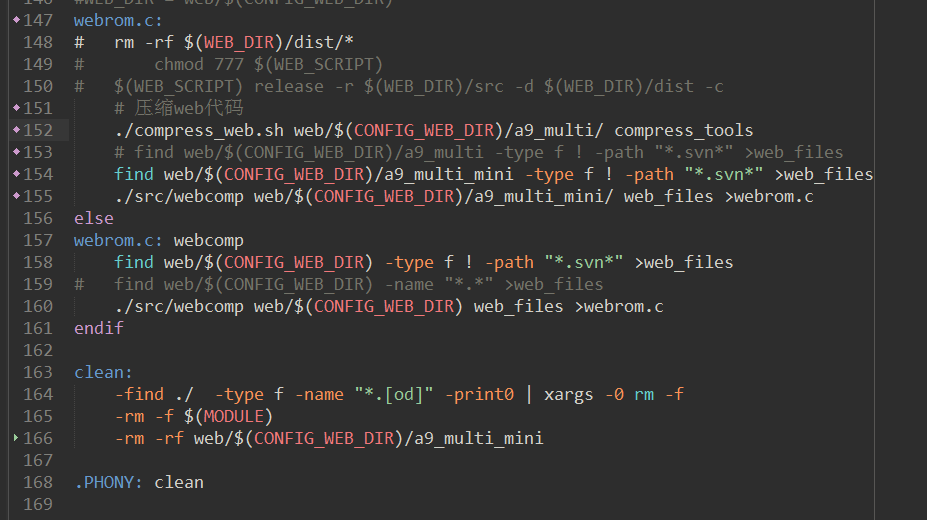
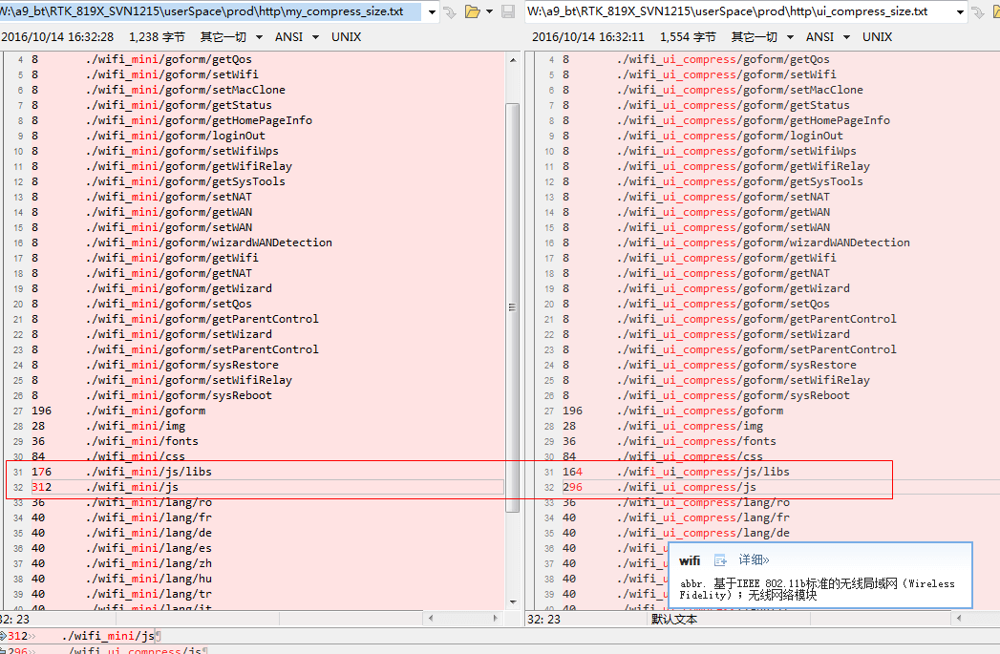

### web代码压缩　　

**整体思路**    
　　使用网上的压缩工具压缩js和css文件，自己编写简单的html和json压缩工具压缩html、json文件，然后集成到Makefile  

---  
#### js、css压缩  

　　直接用现成的工具压缩，没什么好说的  

#### html压缩  

　　html要实现完美压缩，实现很复杂，以至于网上都找不到相应工具了。自己写的压缩很简单，去除空格、tab、换行，这里面也存在**隐藏bug**，这是风险点。  
* 实现的功能：  
　　1、单个文件压缩  
　　2、只压缩空格、tab、换行符　　
　
* 匹配规则：  
　　">string<",去掉右尖括号和左尖括号之间只包含空格、tab、换行符的内容  
  
* 思路：  
　　把文件映射到内存，从映射的内存一个字节一个字节读取数据，如果不是'>',则写入压缩后的文件.
    如果是'>'，记录当前指针，往后读取查找'<'，记录指针。匹配这段字符是否只有空格\tab\换行。
    如果是则在文件写入'<'，否则全部内容写入。  
*代码*  

```c
/************************************************************
Copyright (C), 2016, Leon, All Rights Reserved.
FileName: compress_html.c
Description: 压缩html
Author: Leon
Version: 1.0
Date: 2016年10月14日14:06:37
Function:

History:
<author>    <time>  <version>   <description>
 Leon

bug: 如下这种js代码里的字符串会被破坏
<html>
<script>
    var str="haha: <>  <";
</script>
</html>
************************************************************/

#include <stdio.h>
#include <stdlib.h>
#include <string.h>
#include <sys/types.h>
#include <fcntl.h>
#include <sys/stat.h>
#include <unistd.h>
#include <sys/mman.h>

void usage(void)
{
    printf("ex: ./compress_html login.html > login.mini.html\n");
}

/*****************************************************************************
 函 数 名  : need_compress
 功能描述  : 判断字符串是否需要压缩，即全是空格、tab、换行符
 输入参数  : start：字符串开始，end：字符串结束  
 输出参数  : 无
 返 回 值  : 需要压缩返回1，不需要压缩返回0
 
 修改历史      :
  1.日    期   : 2016年10月14日14:03:37
    作    者   : leon
    修改内容   : 新生成函数

*****************************************************************************/
int need_compress(char *start, char *end)
{
    if(!start || !end)
        return 0;

    for( ;start <= end; start++)
    {
        switch(*start)
        {
            case ' ':
            case '\t':
            case '\n':
            case '\r':
                break;
            default:
                return 0;
        }
    }
    return 1;
}

/*****************************************************************************
 函 数 名  : compress_data
 功能描述  : 解析输入数据，并压缩写入文件
 输入参数  : data：欲压缩的字符串
             len: 数据长度
             output_fp: 需要写入的文件描述符

 输出参数  : 无
 返 回 值  : 无
 
 修改历史      :
  1.日    期   : 2016年10月14日14:05:13
    作    者   : leon
    修改内容   : 新生成函数

*****************************************************************************/
void compress_data(char *data, int len, FILE *output_fp)
{
    if(!data || !len || !output_fp)
        return;

    char *cur = NULL, *start = NULL, *end = NULL;
    int flag = 0;   /*右尖括号'>'是否记录的标志*/

    for(cur = data; cur <= data + len; cur++)
    {
        switch(*cur)
        {
            case '>':
                if(flag == 0)
                {
                    fprintf(output_fp, "%c", *cur);
                    start = cur + 1;
                    flag = 1;
                }
                break;
            case '<':
                if(flag == 0)
                {
                    fprintf(output_fp, "%c", *cur);
                    break;
                }
                end = cur - 1;
                flag = 0;
                /*判断是否只有空格tab换行符*/
                if(!need_compress(start, end))
                    fwrite(start, end - start + 1, 1, output_fp);
                fprintf(output_fp, "%c", *cur);
                break;
            default:
                if(flag == 0)
                    fprintf(output_fp, "%c", *cur);
                break;
        }
    }
}

int main(int argc, char *argv[])
{
    char *file_name = NULL;
    int input_fd = -1;
    char *data = NULL;
    struct stat st;
    int file_size = 0;

    if(argc < 2)
    {
        usage();
        return -1;
    }

    file_name = argv[1];

    if(-1 == stat(file_name,&st))
    {
        fprintf(stderr , "stat %s error: %m\n", file_name);
        return -1;
    }
    file_size = st.st_size;

    input_fd = open(file_name, O_RDONLY);
    if(-1 == input_fd)
    {
        fprintf(stderr, "open %s error:%m\n", file_name);
        return -1;
    }

    data = (char *)mmap(NULL, file_size, PROT_READ, MAP_PRIVATE, input_fd, 0);
    if((char *)-1 == data)
    {
        fprintf(stderr, "mmap error:%m\n");
        close(input_fd);
        return -1;
    }

    /*解析数据*/
    compress_data(data, file_size, stdout);
    /*清理*/
    munmap(data, file_size);
    close(input_fd);

    return 0;
}
```
#### json翻译包压缩  

>其实json的压缩空间很小，一行可以少3个字符，对于1000行的翻译包，可以减少3k的文件大小。体现到flash上，大概只有零点几K了。而A9的翻译包才100多行。   

json语言包压缩注意事项：  
* 从json格式看，只要不处理双引号里面的内容就不会破坏json数据  
* 注意双引号里面可能有转义字符的双引号  

```c

/************************************************************
Copyright (C), 2016, Leon, All Rights Reserved.
FileName: 
Description: 压缩json翻译文件
Author: Leon
Version: 1.0
Date: 2016-10-17 16:37:53
Function:

History:
<author>    <time>  <version>   <description>
 Leon

测试了AC6的韩语、繁体中文，A9的德语语言包，和网上的在线json压缩后内容一致 
************************************************************/

#include <stdio.h>
#include <stdlib.h>
#include <string.h>

#define BUF_SIZE (100*1024)     //处理超长行
#define quota_mark_is_matched(count) (!(count%2))

void usage(void)
{
    char *help = "\
    help:\n\
    example：./compress_json translate.json > translate_tiny.json\
    ";
    fprintf(stderr, "%s\n", help);
}

int deal_text_line(char *line, FILE *output)
{
    int quota_mark_count = 0;   //引号计数
    char *p = line;

    if(!line)
        return -1;

    while(*p)
    {
        switch(*p)
        {
            case ' ':
            case '\t':
            case '\n':
            case '\r':
                if(!quota_mark_is_matched(quota_mark_count))   //引号不匹配
                    fprintf(output, "%c", *p);
                break;
            case '\\':
                //遇到转译字符则跳过转义字符和下一个字符
                fprintf(output, "%c%c", *p, *(p+1));
                p++;
                break;
            case '"':
                quota_mark_count++;
                fprintf(output, "%c", *p);
                break;
            default:
                fprintf(output, "%c", *p);
                break;
        }
        p++;
    }

    if(!quota_mark_is_matched(quota_mark_count))   //引号不匹配
        return -1;
    return 0;
}

int main(int argc, char *argv[])
{
    if(argc < 2)
    {
        usage();
        return -1;
    }

    char *file_name = argv[1];
    FILE *fp = fopen(file_name, "r");
    char *buff = (char *)malloc(BUF_SIZE);

    if(!fp)
    {
        fprintf(stderr, "fopen %s failed: %m\n", file_name);
        goto err;
    }
    if(!buff)
    {
        fprintf(stderr, "malloc failed: %m");
        goto err;
    }

    while(!feof(fp))
    {
        memset(buff, 0x0, BUF_SIZE);
        if(!fgets(buff, BUF_SIZE, fp))
        {
            fprintf(stderr, "fgets error: %m\n");
            goto err;
        }

        if(0 != deal_text_line(buff, stdout))
        {
            fprintf(stderr, "quota mark not matched: %s\n", buff);
            goto err;
        }
    }
    fclose(fp);
    free(buff);
    return 0;

err:
    if(fp)
        fclose(fp);
    if(buff)
        free(buff);
    return -1;
}
```

#### 集成到Makefile  

　　压缩工具都整理好了，就是如何集成到Makefile的问题了。上面的压缩工具基本都是基于单个文件的压缩，因此对于整个web目录的压缩用一个脚本来实现。  
　　脚本遍历目录 >> 判断文件格式 >> 压缩文件 >> 保存到新目录 >> 编译时指定新目录  
*脚本*  

```shell
#!/bin/bash

# 压缩页面代码脚本，leon
# 2016年10月14日14:20:55

path=$1 #输入的页面代码路径
tools_path=$2   #压缩工具的路径

if [ "$1" = "" ] && [ "$2" = "" ] ; then
    echo "args err"
    echo "help: ./compress_web [web_path] [compress_tools_path]"
    echo "example: ./compress_web ./compress_tools"
    exit -1
fi

path=${path/%\//} #去掉末尾的'/'
web_floder=${path##*/}  
save_floder=${web_floder}_mini
save_path=${path/$web_floder/$save_floder}
mkdir -p $save_path

file_list=`find $path -type f ! -path "*.svn*"`

echo "#####################################"
echo "####### compress web...##############"

for file in $file_list
do
    save_path=${file/$web_floder/$save_floder}
    mkdir -p ${save_path%/*}
    case $file in
        *.js)
            java -jar $tools_path/yuicompressor.jar --type js --charset utf-8 --nomunge $file -o $save_path
            [ $? != 0 ] && exit -1
            ;;
        *.css)
            java -jar $tools_path/yuicompressor.jar --type css --charset utf-8 --nomunge $file -o $save_path
            [ $? != 0 ] && exit -1
            ;;
        *.html)
            ${tools_path}/compress_html $file > $save_path
            [ $? != 0 ] && exit -1
            ;;
        *.json)
            ${tools_path}/compress_json $file > $save_path
            [ $? != 0 ] && exit -1
            ;;
        *)
            cp $file $save_path
            [ $? != 0 ] && exit -1
            ;;
    esac
done
echo "####### compress done ###############"
echo "#####################################"

```
*makefile修改点*  
   
  
#### 压缩效果  

　　使用BT A9的代码测试了一下，压缩页面代码后的**升级文件小了12k**，页面显示暂没发现问题。  
　　对比web组用的压缩工具，发现压缩后大小差异在于js文件压缩后的大小  
　　  

* 运行时间  
　　具体运行时可以观察到，压缩整个web代码会用10来秒。  

```shell
root@ubuntu:http# /usr/bin/time ./compress_web.sh wifi compress_tools
#####################################
####### compress web...##############
####### compress done ###############
#####################################
8.68user 3.45system 0:12.52elapsed 96%CPU (0avgtext+0avgdata 37948maxresident)k
0inputs+3712outputs (0major+303997minor)pagefaults 0swaps
```
　　用时这么长，主要是压缩js和css使用java程序，每次java启动很缓慢导致时间很长，压缩html的C代码和shell脚本是执行很快的。  

---


　

