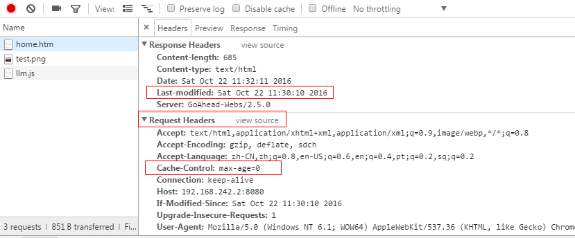
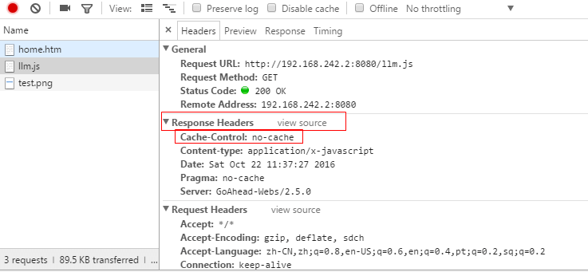

# web页面文件的缓存处理  

## 一、需要解决什么问题  
　　解决客户升级软件后每次都需要清除浏览器缓存的麻烦问题  

## 二、缓存概述  
　　*浏览器缓存的详细内容见http://www.cnblogs.com/lyzg/p/5125934.html*  
　　浏览器的缓存分为强缓存和协商缓存。区别在于协商缓存会先向服务器确认资源是否修改，没有修改才从缓存拿数据，而强缓存直接从缓存拿数据。  
* **强缓存**  
强缓存利用Expires或者Cache-Control这两个http header实现，即浏览器读这个超期时间，超期了才从服务器请求数据。 

* **协商缓存**  
协商缓存是利用的是【Last-Modified，If-Modified-Since】和【ETag、If-None-Match】这两对Header来管理的，前一对是通过文件修改时间戳判断是否修改，后一对是通过生成文件摘要判断是否修改。  
* 浏览器操作对缓存的影响  
<table>
<tr><td>用户操作</td><td>强缓存</td><td>协商缓存</td></tr>
<tr><td>地址栏回车</td><td>有效</td><td>有效</td></tr>
<tr><td>页面链接跳转</td><td>有效</td><td>有效</td></tr>
<tr><td>新开窗口</td><td>有效</td><td>有效</td></tr>
<tr><td>前进后退</td><td>有效</td><td>有效</td></tr>
<tr><td>F5刷新</td><td>无效</td><td>有效</td></tr>
<tr><td>ctrl+F5</td><td>无效</td><td>无效</td></tr>
</table>  
  
## 三、实战分析  

　　我们的产品webserver都是goahead，下载源码，编译版本，测试。测试的页面很简单，只有一个主页面，里面嵌了一个js文件，一个图片文件。  

* 浏览器地址栏不断回车，发现home.htm页面都是从服务器拿数据，而llm.js和test.png则是从缓存拿数据。点后退前进时，则全部数据都从缓存拿。  
  
为什么home.htm没有缓存呢，看了下请求，发现request header里max-age设为了0。而这并不是页面代码里设置的，所以这是浏览器的一个默认行为，**不缓存html文件，只缓存js/css/图片等文件**  
  

* 用chrome浏览器测试AC6时还发现一个有趣的问题，有时浏览器总是从服务器拿数据，不从缓存拿数据了。路由器连上网后，浏览器开始从缓存区数据。猜测这是浏览器自己的行为，判断了response字段里date值，因为路由器没同步网络时间，导致date为一个很早的时间。   
    
*firefox也是如此。IE10则总是有缓存，网络捕获里面还显示状态码304，但请求报头里If-Modified-Since字段都没有，显然IE说304是扯淡的，用的强缓存*  

### 利用http协议的Cache-Control头来处理缓存  

　　从上面的分析可以看出，webserver完全可以设置Cache-Control为no-cache，让浏览器不缓存页面。基于goahead也很好改，`websDefaultHandler()`函数改一行代码就OK了。重启server测了一下，发现每次response确实带了no-cache的头，浏览器也不缓存页面了，先不考虑性能，似乎这样改很好用。  
  
但反复测试发现，如果浏览器在你升级webserver之前就缓存了页面，那么这么改是不生效的，除非F5刷新才能跳过强缓存，得到no-cache头的新页面，之后这页面就都不缓存了。基于这点问题，还需要需找其他方法来消除缓存。  

### 利用文件链接添加后缀的办法

　　因为像test.png这种资源文件都以链接的形式嵌在页面文件里，浏览器分析页面时判断这个链接是否已经缓存，所以可以通过每次更新页面时都修改链接的方式来清除缓存。例如把``改为``  
* 需要处理哪些页面文件呢  
    1. html里嵌的资源文件  
    `<link href="css/reasy-ui.css" rel="stylesheet">`  
    `<script src="lang/b28n_async.js"></script>`    

    2. css里的资源文件  
    `.index-body .mastbody { background: url(../img/shadow.jpg) no-repeat center 100%; }`  

    3. js里面嵌的资源文件  
    `$(".loadding-ok img").attr("src", "./img/ok_connected.png")`  

* 添加什么后缀  
    1. 添加随机数    
    2. 添加版本号  
    3. 添加文件摘要MD5值  
**最好的策略是加文件摘要作为后缀**（分析略），这样做既可以免受缓存影响，又可以提高网页访问速度。 

## 四、实现  

>**思路：**从上面需要处理的文件可以看出，这些字符串前后并没有明显的特征。如果只是处理html里的倒是可以通过分析html标签来识别。因此只想到一个简单粗暴的方法：**不分析页面内容，搜索替换文件名**。即提取页面文件夹的文件名，以文件名作为匹配字符串，然后遍历文件，文件内容有匹配上则替换为带后缀的文件名。  


### shell实现    
　　有了思路，shell里很快就实现了。  
*nocache.sh*  
```shell
#!/bin/bash

# web资源文件链接替换脚本，leon
# 2016年10月22日15:24:27

path=$1 #输入的页面代码路径

if [ "$1" = "" ]; then
    echo "args err"
    echo "help: ./no_cache [web_path]"
    echo "example: ./no_cache ./web"
    exit -1
fi

path=${path/%\//} #去掉末尾的'/'
web_floder=${path##*/}  
save_floder=${web_floder}_nocache
save_path=${path/$web_floder/$save_floder}
mkdir -p $save_path

cp -rf $path/* $save_path
savepath_list=`find $save_path -type f ! -path "*.svn*"`

cnt1=0
cnt2=0

function replace()
{
    src=$1
    dest=$2

    for filepath in $savepath_list
    do
        case $filepath in 
            *.html|*.js|*.css)
                sed -i "s/$src/$dest/g" $filepath
                ((cnt2++))
                ;;
        esac
    done
}

for filepath in $savepath_list
do
    case $filepath in 
        *.js|*.css|*.png|*.jpg|*.gif)
            name=${filepath##*/}
            md5=`md5sum $filepath | awk '{print $1}'`
            newname=$name?$md5
            replace $name $newname
            ((cnt1++))
            ;;
    esac
done

echo "#####################################"
echo $cnt1  $cnt2

```
　　效率很低，如下是执行时间:  
```
root@ubuntu:web_cache# time ./nocache.sh web
#####################################
158 19750

real    1m11.173s
user    0m2.140s
sys     0m17.672s
```
AC6的页面共158个资源文件，125个页面可能嵌入资源文件。所以sed文件替换操作执行了19750次。user time不长，sys time很长，real time更是长达1分多钟。IO操作占用了太多时间，得写个C程序试试。  
实际上上面的脚本有个问题：**资源文件名部分重叠的问题**：如ali_code.png和code.png，处理会有问题。  


### c实现  
　　cpu操作比IO操作快很多，因此我们得尽量减少文件的读和写操作的次数。因此可以自己写文件内容替换的程序，不在shell脚本里循环使用sed。   
　　想法是这样的：读入一个页面文件到内存，然后通过关键字匹配，匹配上后做一个标记，标记以链表的形式存储，标记点存储了匹配位置的指针和匹配的关键字，每次更新标记链表时都对标记位置排序。待所有关键字匹配完，再开始写文件。写文件时以标记点来分割，一段一段写入，不匹配的直接写入，匹配的则写入关键字的替换部分。这样就保证了每个文件最多只读写了一次。  
　　效果也确实很好，整个替换操作用时0.1s  

```
root@ubuntu:web_cache# time ./replace_uri key.txt file.txt 

real    0m0.129s
user    0m0.072s
sys     0m0.048s
```
　　再整合到shell里面，shell里读文件生成MD5用时长一点，但也可以接受了。再优化就是用c完全取缔shell脚本了，但把目录遍历，过滤，MD5计算这些加进来程序势必很长了，不好维护。    
```
root@ubuntu:web_cache# time ./nocache_test.sh web2
#####################################

real    0m1.358s
user    0m0.124s
sys     0m0.132s
```

**问题：**  
1. 对于浏览器标题的小图标怎么处理  

***  


### 代码  
*nocache_v2.sh*  
```shell
#!/bin/bash

# web资源文件链接替换脚本，leon
# 2016年10月22日15:24:27

path=$1 #输入的页面代码路径

if [ "$1" = "" ]; then
    echo "args err"
    echo "help: ./no_cache [web_path]"
    echo "example: ./no_cache ./web"
    exit -1
fi

path=${path/%\//} #去掉末尾的'/'
web_floder=${path##*/}  
save_floder=${web_floder}_nocache
save_path=${path/$web_floder/$save_floder}
mkdir -p $save_path

cp -rf $path/* $save_path
savepath_list=`find $save_path -type f ! -path "*.svn*"`

# 生成需要替换的uri对列表
for filepath in $savepath_list
do
    case $filepath in 
        *.js|*.css|*.png|*.jpg|*.gif)
            # 遍历文件html,css,js文件替换文件名
            name=${filepath##*/}
            md5=`md5sum $filepath | awk '{print $1}'`
            newname=$name?$md5
            echo "$name $newname" 
            # replace $name $newname
            ;;
    esac
done > key.txt

echo "#####################################"

# 生成需要替换的文件列表
find $save_path -type f ! -path "*.svn*" | grep -E ".*\.((css)|(js)|(html))$" > file.txt

# 替换
./replace_uri key.txt file.txt

```
*replace_uri.c*  
```c
/************************************************************
Copyright (C), 2016, Leon, All Rights Reserved.
FileName: replace_uri.c
Description: 输入两个文件
    关键字文件：记录需要替换的uri对
    目标文件：记录需要替换的目标文件
Author: Leon
Version: 1.0
Date: 
Function:

History:
<author>    <time>  <version>   <description>
 Leon
************************************************************/

#include <stdio.h>
#include <stdlib.h>
#include <string.h>
#include<sys/stat.h>
#include<unistd.h>

#define KEY_LEN 128
#define FILE_NAME_LEN   256

/* 匹配的关键字对 */
struct key
{
    char src[KEY_LEN];
    char dest[KEY_LEN];
    struct key *next;
};

struct file_list
{
    char name[FILE_NAME_LEN];
    struct file_list *next;
};

struct match_result
{
    char key_src[KEY_LEN];
    char key_dest[KEY_LEN]; /*方便写文件*/
    char *index;
    struct match_result *next;
};

struct key key_head = {0};
struct file_list file_list_head = {0};
struct match_result match_result_head = {0};

/******************************************************************************/

int r_fread(void *ptr, int size, int nmemb, FILE *stream);
int r_fwrite(void *ptr, int size, int nmemb, FILE *stream);
int update_key_list(char *src, char *dest);
int update_file_list(char *name);
int init(char *key_file, char *target_file);
void fini(void);
void free_key_list(void);
void free_file_list(void);
char *match_key(char *buff, char *key, char **index);
void match_all_key(char *buff);
int update_match_result(char *key_src, char *key_dest, char *index);
void free_match_result();
void print_match_result(char *filename);
void *r_malloc(int size);
int file_replace(FILE *fp, char *buf, int buf_size);
int main_loop(void);

/******************************************************************************/


int r_fread(void *ptr, int size, int nmemb, FILE *stream)
{
    int ret = 0;
    int read_size = 0;
    int need_read = size*nmemb;

    do
    {
        ret = fread(ptr, size, nmemb, stream);
        need_read -= ret;
        read_size += ret;
    }while(need_read && !feof(stream));
    return read_size;
}

int r_fwrite(void *ptr, int size, int nmemb, FILE *stream)
{
    int ret = 0;
    int write_size = 0;
    int need_write = size*nmemb;
    
    do
    {
        ret = fwrite(ptr, size, nmemb, stream);
        need_write -= ret;
        write_size += ret;
    }while(need_write);
    return write_size;
}

int update_key_list(char *src, char *dest)
{
    struct key *new = NULL;

    if(!src || !dest)
        return -1;

    new = r_malloc(sizeof(struct key));
    if(!new)
        return -1;
    strncpy(new->src, src, KEY_LEN - 1);
    strncpy(new->dest, dest, KEY_LEN - 1);
    /* 头插法 */
    new->next = key_head.next;
    key_head.next = new;
    return 0;
}

int update_file_list(char *name)
{
    struct file_list *new = NULL;

    if(!name)
        return -1;

    new = r_malloc(sizeof(struct file_list));
    if(!new)
        return -1;
    strncpy(new->name, name, FILE_NAME_LEN - 1);
    /* 头插法 */
    new->next = file_list_head.next;
    file_list_head.next = new;
    return 0;
}

//解析输入文件,初始化key_head链表和file_list_head链表
int init(char *key_file, char *target_file)
{
    FILE *fp = NULL;
    char buf[1024] = {0};

    /* 初始化key list */
    fp = fopen(key_file, "r");
    if(!fp)
    {
        fprintf(stderr, "fopen %s failed: %m\n", key_file);
        return -1;
    }
    while(fgets(buf, sizeof(buf), fp))
    {
        char *src = NULL, *dest = NULL;
        int len = strlen(buf);
        if(buf[len - 1] = '\n')
            buf[len - 1] = '\0';
        dest = strchr(buf, ' ');
        if(!dest)
        {
            fprintf(stderr, "format error, %s\n", buf);
        }
        else
        {
            *dest = 0;
            dest++;
            src = buf;
        }
        update_key_list(src, dest);
        memset(buf, 0x0, sizeof(buf));
    }
    fclose(fp);

    /* 初始化file list */
    fp = fopen(target_file, "r");
    if(!fp)
    {
        fprintf(stderr, "fopen %s failed: %m\n", key_file);
        free_key_list();
        return -1;
    }
    while(fgets(buf, sizeof(buf), fp))
    {
        int len = strlen(buf);
        if(buf[len - 1] = '\n')
            buf[len - 1] = '\0';
        update_file_list(buf);
        memset(buf, 0x0, sizeof(buf));
    }
    fclose(fp);

    return 0;
}

void fini(void)
{
    free_key_list();
    free_file_list();
    free_match_result();
}

void free_key_list(void)
{
    struct key *tmp, *p = key_head.next;

    if(p)
    {
        tmp = p;
        p = p->next;
        free(tmp);
    }
    key_head.next = NULL;
}

void free_file_list(void)
{
    struct file_list *tmp, *p = file_list_head.next;

    if(p)
    {
        tmp = p;
        p = p->next;
        free(tmp);
    }
    file_list_head.next = NULL;
}

//buff全部匹配完则返回NULL，否则返回当前匹配位置加上key长度的指针，index为输出参数。
char *match_key(char *buff, char *key, char **index)
{
    if(!buff || !key || !index)
        return NULL;

    char *result = NULL;

again:
    result = strstr(buff, key);
    if(result)
    {
        /* 过滤一下部分匹配的问题，这么做对于文件名包含这些的自然就不行了 */
        --result;
        if(*result != '/' && *result != '"' && *result != '\'' && *result != '(')
        {
            //文件名只是部分匹配，需要重新匹配
            buff = result + 1 + strlen(key);
            goto again; 
        }
        ++result;
        *index = result;
        return result + strlen(key);
    }
    return NULL;
}

void match_all_key(char *buff)
{
    struct key *p = key_head.next;
    char *index = NULL;
    char *tmp = buff;

    while(p)
    {
        while((buff = match_key(buff, p->src, &index)))
        {
            update_match_result(p->src, p->dest, index);
        }
        p = p->next;
        buff = tmp;
    } 
}

//更新匹配结果列表,按index大小升序排序
int update_match_result(char *key_src, char *key_dest, char *index)
{
    struct match_result *cru, *pre, *new;

    if(!key_src || !key_dest || !index)
        return -1;

    new = r_malloc(sizeof(struct match_result));
    if(!new)
        return -1;

    strcpy(new->key_src, key_src);
    strcpy(new->key_dest, key_dest);
    new->index = index;

    pre = &match_result_head;
    cru = pre->next;
    while(cru)
    {
        if(cru->index > index)
        {
            break;
        }
        pre = cru;
        cru = pre->next;
    }
    pre->next = new;
    new->next = cru;
    return 0;
}

void print_match_result(char *filename)
{
    struct match_result *p = match_result_head.next;

    printf("****%s*****\n", filename);
    while(p)
    {
        printf("%s\n", p->key_src);
        p = p->next;
    }
    printf("*********\n\n");
}

void free_match_result()
{
    struct match_result *tmp, *p = match_result_head.next;

    if(p)
    {
        tmp = p;
        p = p->next;
        free(tmp);
    }
    match_result_head.next = NULL;
}

void *r_malloc(int size)
{
    void *p = malloc(size);

    if(!p)
    {
        fprintf(stderr, "malloc failed: %m\n");
        return NULL;
    }
    memset(p, 0x0, size);
    return p;
}

int file_replace(FILE *fp, char *buf, int buf_size)
{
    struct match_result *p = match_result_head.next;
    char *begin = buf, *end = NULL;
    int ret = 0;

    if(!p)
    {
        /* 没匹配上，不需要替换，直接返回 */
        return 0;
    }

    /*文件游标移到第一个匹配处*/
    //fseek(fp, p->index - buf, SEEK_SET);
    begin = buf;
    while(p)
    {
        end = p->index;
        ret = r_fwrite(begin, 1, end - begin, fp);
        r_fwrite(p->key_dest, 1, strlen(p->key_dest), fp);
        begin = begin + ret + strlen(p->key_src);
        p = p->next;
    }
    r_fwrite(begin, 1, buf + buf_size - begin, fp);
    return 0;
}

int main_loop(void)
{
    struct file_list *p = file_list_head.next;
    FILE *fp = NULL;
    struct stat st;
    int size = 0;
    char *buf = NULL;

    while(p)
    {
        if(-1 == stat(p->name, &st))
        {
            fprintf(stderr, "stat %s failed: %m\n", p->name);
            return -1;
        }
        size = st.st_size;

        fp = fopen(p->name, "r+");
        if(!fp)
        {
            fprintf(stderr, "fopen file %s failed: %m\n", p->name);
            return -1;
        }

        buf = r_malloc(size);
        if(!buf)
        {
            fprintf(stderr, "malloc failed: %m\n");
            fclose(fp);
            return -1;
        }
        r_fread(buf, size, 1, fp);
        /*匹配*/
        match_all_key(buf);
        //print_match_result(p->name);
        /*改写文件*/
        //直接写文件，因为新文件长度肯定不会比老文件短
        fseek(fp, 0, SEEK_SET);
        file_replace(fp, buf, size);
        fclose(fp);
        free(buf);
        free_match_result();
        p = p->next;
    }

    return 0;
}

int main(int argc, char *argv[])
{
    if(argc < 3)
    {
        return -1;
    }

    init(argv[1], argv[2]);
    main_loop();
    fini();
    return 0;
}
```

***
